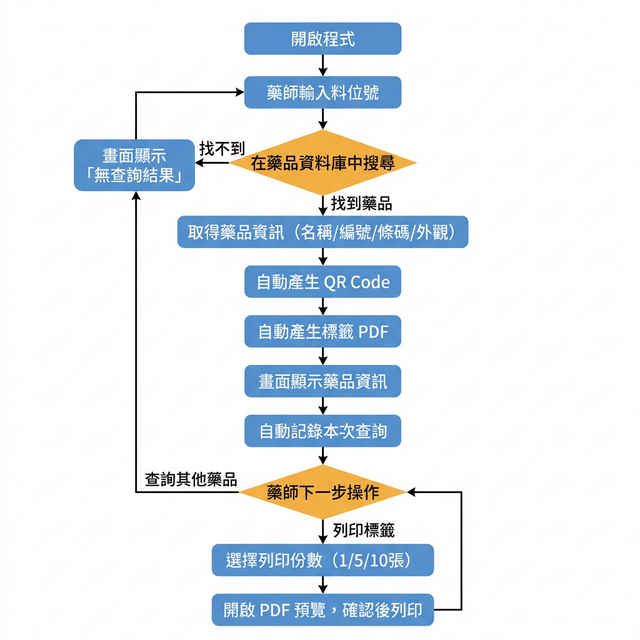
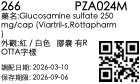

# SATO 機台標籤列印程序 (Mac 版)

> **林口長庚 SATO 標籤機藥品標籤列印系統**
> 版本：v1.2 (Mac 修復版) ｜ 作者：蕭兆軒

---

## 一、程式概要

本程式為醫院藥局使用的 **藥品標籤列印工具**，供藥師透過輸入「料位號」快速查詢藥品資訊，並自動產生含有 **QR Code** 的 PDF 標籤，透過印表機列印貼附於藥品儲位或調配容器上。

Mac 版以 `main_mac.py` 為主程式，Windows 版以 `main.py` 為主程式，兩者皆使用 **wxPython** 建立桌面 GUI 介面。

---

## 二、系統架構

### 檔案結構

| 檔案               | 說明                                                                                 |
| ------------------ | ------------------------------------------------------------------------------------ |
| `main_mac.py`      | Mac 版主程式（GUI + 業務邏輯）                                                       |
| `Adgn.txt`         | 藥品主檔（含料位號、藥品編號、藥品名稱、條碼等），以分號 `;` 分隔，編碼為 CP950/Big5 |
| `drugdata.csv`     | 藥品外觀資料檔（含顏色、形狀、劑型、中文加強描述），逗號分隔，編碼為 CP950/Big5      |
| `CGMH.ico`         | 視窗圖示（長庚院徽）                                                                 |
| `data.csv`         | 其他資料檔（非 Mac 版核心使用）                                                      |
| `SearchRecord.csv` | 查詢紀錄檔（程式自動產生）                                                           |
| `output.pdf`       | 最近一次產生的標籤 PDF（程式自動產生）                                               |

### 技術元件

| 元件          | 用途                        |
| ------------- | --------------------------- |
| **wxPython**  | 桌面 GUI 框架               |
| **pandas**    | 讀取與篩選 CSV / 分隔檔     |
| **ReportLab** | 產生 PDF 標籤               |
| **qrcode**    | 產生藥品條碼之 QR Code 圖像 |
| **PyPDF2**    | 複製 PDF 頁面以支援多份列印 |

---

## 三、程式運作流程

### 流程圖



---

## 四、標籤輸出格式

標籤尺寸為 **140mm × 84mm**，以下為實際產生的標籤範例：



標籤內容包含：
- **頂部**：料位號、藥品編號
- **中段**：藥品名稱、外觀描述（顏色/形狀/劑型）
- **右下**：QR Code（內容為藥品條碼）
- **左下**：調配日期（當天）、保存期限（+180 天）

---

## 五、環境需求與安裝

### Python 套件依賴

專案依賴已整理在 `requirements.txt` 中。其中 `pywin32` 為 Windows 版專屬套件，Mac 環境下安裝時將自動忽略。
請使用以下指令安裝所有依賴套件：

```bash
pip install -r requirements.txt
```

核心依賴包含：
- `wxPython` (GUI 框架)
- `pandas` (資料處理)
- `reportlab` (PDF 產生)
- `qrcode` (QR Code 產生)
- `PyPDF2` (PDF 頁面處理)
- `pywin32` (Windows 版專用的列印控制)

### 系統字體依賴

| 用途     | 字體路徑                                   |
| -------- | ------------------------------------------ |
| PDF 正文 | `/System/Library/Fonts/STHeiti Light.ttc`  |
| PDF 標題 | `/System/Library/Fonts/STHeiti Medium.ttc` |
| GUI 介面 | `Heiti TC`（系統內建）                     |

### 啟動方式

確保系統環境與字體設定正確後，可根據作業系統啟動對應的主程式：

- **Windows 環境**：
  ```bash
  python main.py
  ```
- **Mac 環境**：
  ```bash
  python3 main_mac.py
  ```

---

## 六、查詢紀錄 (SearchRecord.csv)

程式每次查詢都會自動紀錄至 `SearchRecord.csv`，欄位如下：

| 欄位     | 說明                   |
| -------- | ---------------------- |
| 日期     | 查詢日期 (YYYY-MM-DD)  |
| 時間     | 查詢時間 (HH:MM:SS)    |
| 料位號   | 查詢的料位號           |
| 列印調用 | 是否有按列印按鈕 (Y/N) |
| 列印次數 | 選擇的列印份數         |

---

## 七、與 Windows 版差異

| 項目         | Windows 版 (`main.py`) | Mac 版 (`main_mac.py`)                       |
| ------------ | ---------------------- | -------------------------------------------- |
| 字體         | 微軟正黑體 (msjh)      | 黑體-繁 (STHeiti)                            |
| 列印方式     | 直接呼叫印表機 API     | 使用 `open` 指令開啟 PDF 預覽                |
| 編碼處理     | CP950 直接讀取         | CP950 → 加上 `errors='ignore'` fallback Big5 |
| 列印按鈕文字 | 「列印」               | 「測試列印(Mac預覽)」                        |
